# NXP Application Code Hub
[](https://www.nxp.com)

## 4x4 Key Click: multi-platform ecosystem.
This demo is an example for [4x4 Key Click](https://www.mikroe.com/4x4-key-click). It is enable with CMSIS driver and NXP HAL Software and is supported in multiple FRDM boards.

### Specific boards
- FRDM MCXA153   
[<p align="center">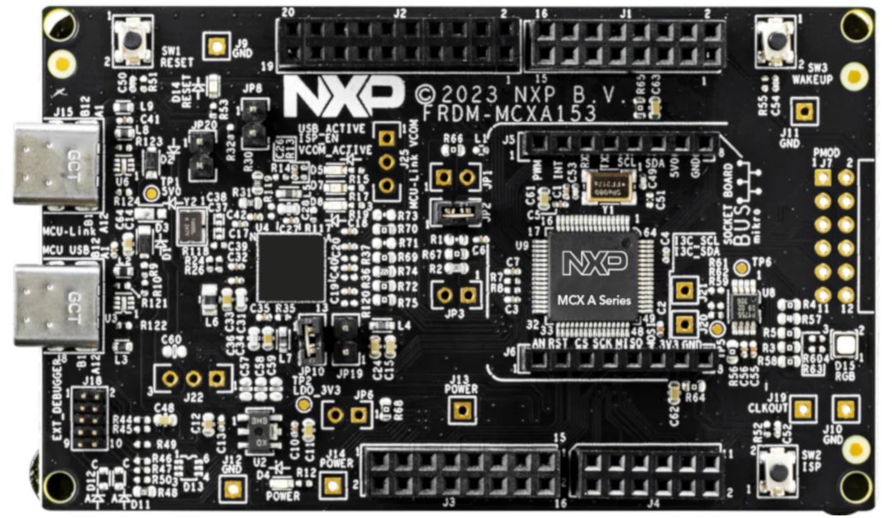</p>](Common/Images/MCXA153.png)
- FRDM MCXA156   
[<p align="center"></p>](Common/Images/MCXA156.png)
- FRDM MCXC041   
[<p align="center">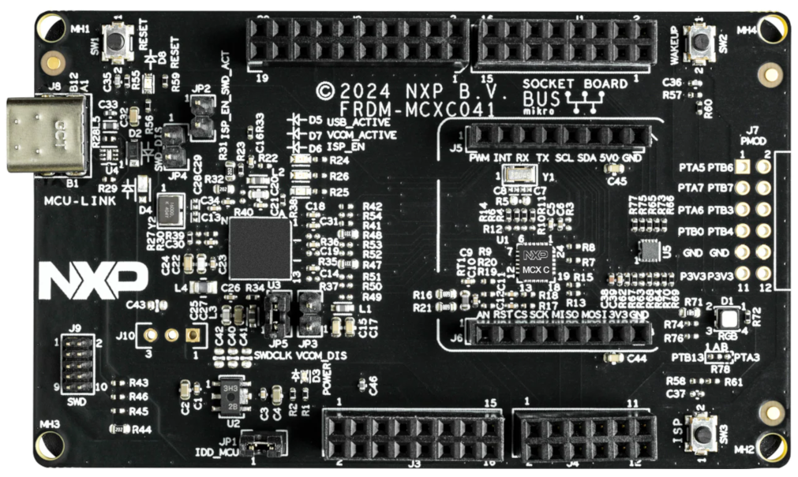</p>](Common/Images/MCXC041.png)
- FRDM MCXC242   
[<p align="center">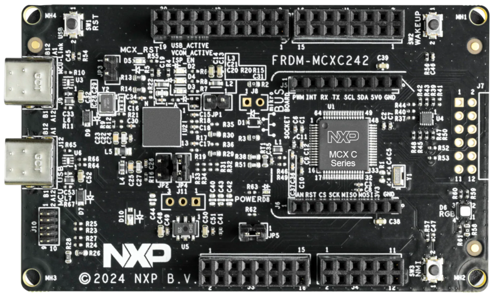</p>](Common/Images/MCXC242.png)
- FRDM MCXC444   
[<p align="center"></p>](Common/Images/MCXC444.png)
- FRDM MCXN236   
[<p align="center"></p>](Common/Images/MCXN236.png)
- FRDM MCXN947   
[<p align="center">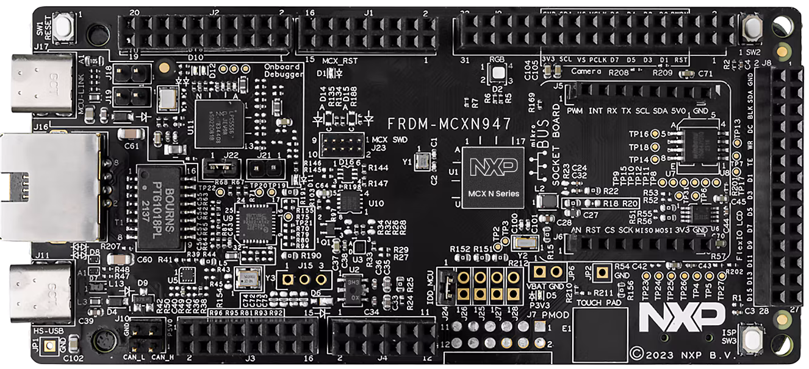</p>](Common/Images/MCXN947.png)   
- FRDM MCXW71   
[<p align="center">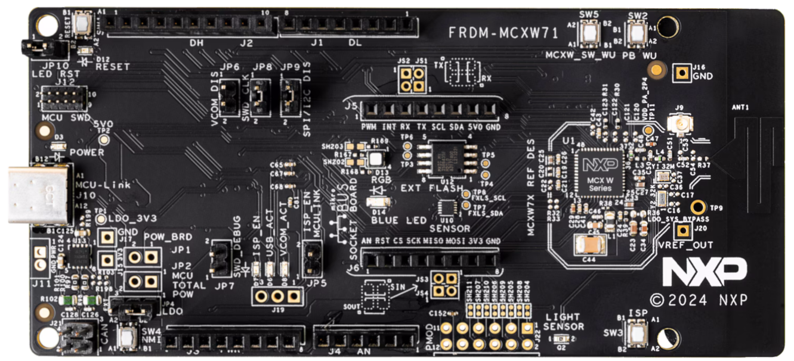</p>](Common/Images/MCXW71.png)

#### Boards: FRDM-MCXA153, FRDM-MCXA156, FRDM-MCXC041, FRDM-MCXC242, FRDM-MCXC444, FRDM-MCXN236, FRDM-MCXN947, FRDM-MCXW71
#### Categories: Tools, HMI, Industrial
#### Peripherals: GPIO, SPI
#### Toolchains: MCUXpresso IDE, VS Code

## Table of Contents
1. [Software](#step1)
2. [Hardware](#step2)
3. [Setup](#step3)
4. [Results](#step4)
7. [Release Notes](#step7)

## 1. Software<a name="step1"></a>
- [MCUXpresso 11.10.0 or newer.](https://nxp.com/mcuxpresso)
- [MCUXpresso for VScode 24.8.9 or newer](https://www.nxp.com/products/processors-and-microcontrollers/arm-microcontrollers/general-purpose-mcus/lpc800-arm-cortex-m0-plus-/mcuxpresso-for-visual-studio-code:MCUXPRESSO-VSC?cid=wechat_iot_303216)
- SDK per FRDM board

## 2. Hardware<a name="step2"></a>
**Note:** See README in specific project folder.

- [FRDM](https://www.nxp.com/design/design-center/development-boards-and-designs/general-purpose-mcus:FREDEVPLA)   
- [MIKROE 4x4-KEY-CLICK](https://www.mikroe.com/4x4-key-click)   
[<p align="center">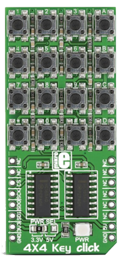</p>](Common/Images/4x4-key-click.png)

## 3. Setup<a name="step3"></a>

1. Import project into MCUXpresso.
    
    Follow the screens to import the projects.
    
    - On brand new workspaces, find `Import projects` under `Project Explorer`. If not, find it under `File > Import...`
        [<p align="center">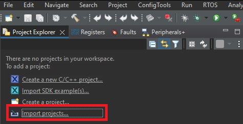</p>](Common/Images/import_project.png)
        
    - On the next pop-up select `General > Existing Projectds into Workspace` and hit `Next`
        [<p align="center">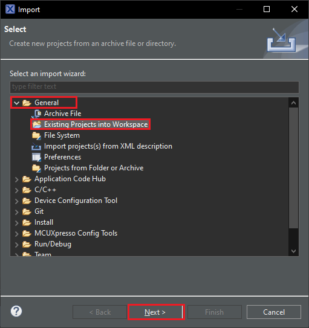</p>](Common/Images/existing_project.png)

    -  On the following screen browse the location of projects.
        [<p align="center">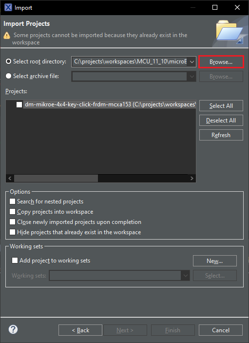</p>](Common/Images/browse.PNG)
        [<p align="center">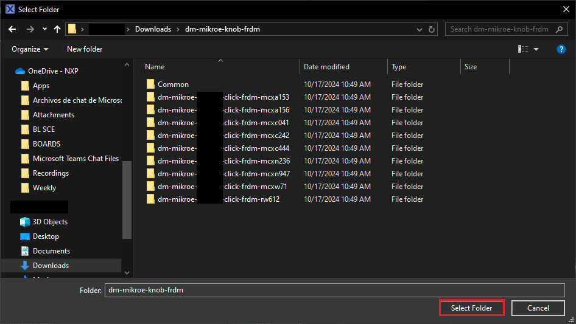</p>](Common/Images/source_folder.png)
    
    - Chek the boxes of the projects you like to import and hit `Finish`.
    [<p align="center">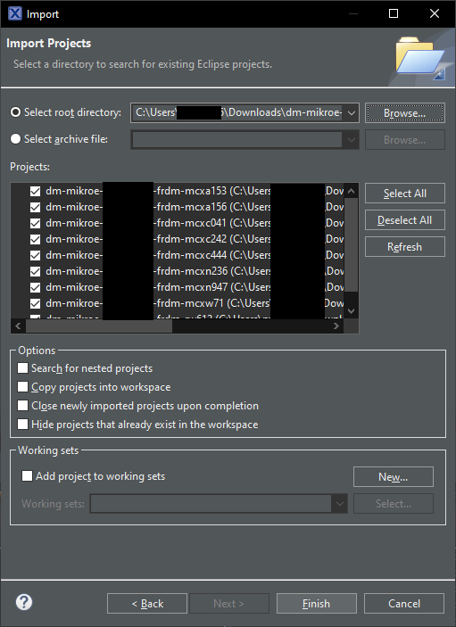</p>](Common/Images/import_finish.png)

2. Build specific project.
3. Connect board to your computer.
4. Upload code to board.
5. Open a terminal with the following settings:
    - 115200 baud rate
    - 8 data bits
    - No parity
    - One stop bit
    - No flow control
6. Push reset button.

## 4. Results<a name="step4"></a>

After reset the forllowing is show:
```
Hello World
```
[<p align="center">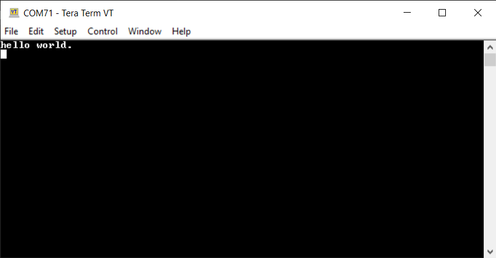</p>](Common/Images/hello_w.png)

Whenever a position update ocurrs the forllowing is show:
```
SW Press: X
```
X is the sw pressed. Multiple buttons can be pressed a the same time.
[<p align="center">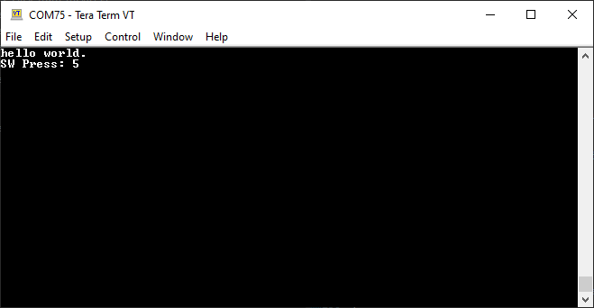</p>](Common/Images/pos.png)


#### Project Metadata

<!----- Boards ----->
[]()
[]()
[]()
[]()
[]()
[]()
[](https://www.nxp.com/pip/RW612)
[]()
[]()

<!----- Categories ----->
[](https://github.com/search?q=org%3Anxp-appcodehub+tools+in%3Areadme&type=Repositories)
[](https://github.com/search?q=org%3Anxp-appcodehub+hmi+in%3Areadme&type=Repositories)
[](https://github.com/search?q=org%3Anxp-appcodehub+industrial+in%3Areadme&type=Repositories)

<!----- Peripherals ----->
[](https://github.com/search?q=org%3Anxp-appcodehub+gpio+in%3Areadme&type=Repositories)
[](https://github.com/search?q=org%3Anxp-appcodehub+spi+in%3Areadme&type=Repositories)

<!----- Toolchains ----->
[](https://github.com/search?q=org%3Anxp-appcodehub+mcux+in%3Areadme&type=Repositories)
[](https://github.com/search?q=org%3Anxp-appcodehub+vscode+in%3Areadme&type=Repositories)

Questions regarding the content/correctness of this example can be entered as Issues within this GitHub repository.

>**Warning**: For more general technical questions regarding NXP Microcontrollers and the difference in expected functionality, enter your questions on the [NXP Community Forum](https://community.nxp.com/)

[](https://www.youtube.com/NXP_Semiconductors)
[](https://www.linkedin.com/company/nxp-semiconductors)
[](https://www.facebook.com/nxpsemi/)
[](https://x.com/NXP)

## 7. Release Notes<a name="step7"></a>
| Version | Description / Update                           | Date                        |
|:-------:|------------------------------------------------|----------------------------:|
| 1.0     | Initial release on Application Code Hub        | December 3<sup>rd</sup> 2024 |

<small>
<b>Trademarks and Service Marks</b>: There are a number of proprietary logos, service marks, trademarks, slogans and product designations ("Marks") found on this Site. By making the Marks available on this Site, NXP is not granting you a license to use them in any fashion. Access to this Site does not confer upon you any license to the Marks under any of NXP or any third party's intellectual property rights. While NXP encourages others to link to our URL, no NXP trademark or service mark may be used as a hyperlink without NXP’s prior written permission. The following Marks are the property of NXP. This list is not comprehensive; the absence of a Mark from the list does not constitute a waiver of intellectual property rights established by NXP in a Mark.
</small>
<br>
<small>
NXP, the NXP logo, NXP SECURE CONNECTIONS FOR A SMARTER WORLD, Airfast, Altivec, ByLink, CodeWarrior, ColdFire, ColdFire+, CoolFlux, CoolFlux DSP, DESFire, EdgeLock, EdgeScale, EdgeVerse, elQ, Embrace, Freescale, GreenChip, HITAG, ICODE and I-CODE, Immersiv3D, I2C-bus logo , JCOP, Kinetis, Layerscape, MagniV, Mantis, MCCI, MIFARE, MIFARE Classic, MIFARE FleX, MIFARE4Mobile, MIFARE Plus, MIFARE Ultralight, MiGLO, MOBILEGT, NTAG, PEG, Plus X, POR, PowerQUICC, Processor Expert, QorIQ, QorIQ Qonverge, RoadLink wordmark and logo, SafeAssure, SafeAssure logo , SmartLX, SmartMX, StarCore, Symphony, Tower, TriMedia, Trimension, UCODE, VortiQa, Vybrid are trademarks of NXP B.V. All other product or service names are the property of their respective owners. © 2021 NXP B.V.
</small>